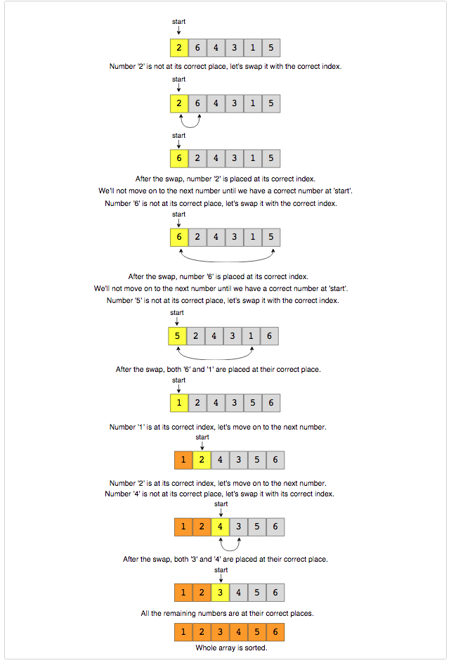

# Grokking the Coding Interview in 16 Patterns

# Pattern 1: Sliding Window

They are subsets of dynamic programming problems, through the approach to solving them is quite different from the one in solving *tabulation* and *memoization* problems.

## How do you identify them ?

The first thing you want to be able to do is <u>identify a problem</u> that uses a sliding window paradigm.

Some giveaways:

1. The problem will <u>involve a data structure that is ordered and iterable</u> like an array or a string. 
2. You are looking for <u>some contiguous subrange in that array/string</u>, like a longest, shortest or target value, or whether a value is contained with the iterable.
3. There is an apparent naïve or <u>brute force solution that runs in O(N<sup>2</sup>), O(2<sup>N</sup>)</u> or some other large time complexity.

> The biggest giveaway is that the thing you are looking for is often some kind of **optimal**, like the **longest** sequence or **shortest** sequence of something that satisfies a given condition **exactly**.
>
> The thing about sliding window problems is that most of the time they <u>can be solved in O(N) time and O(1) space complexity</u>.

Example, **Bit-Flip Problem**

Given a binary array, find the maximum number of zeroes in an array with one flip of a subarray allowed. A flip operation switches all 0s to 1s and vice versa.

OR

You are given a binary string(*i.e.* with characters `0` and `1`) S consisting of characters S<sub>1</sub>, S<sub>2</sub>, …, S<sub>N</sub>. In a single operation, you can choose two indices L and R such that 1 ≤ L ≤ R ≤ N and flip the characters S<sub>L</sub>, S<sub>L+1</sub>, …, S<sub>R</sub>. By flipping, we mean change character `0` to `1` and vice-versa.

Your aim is to perform ATMOST one operation such that in final string number of `1`s is maximized. If you don’t want to perform the operation, return an empty array. Else, return an array consisting of two elements denoting L and R. If there are multiple solutions, return the lexicographically smallest pair of L and R.

```
S = 010

Pair of [L, R] | Final string
_______________|_____________
[1 1]          | 110
[1 2]          | 100
[1 3]          | 101
[2 2]          | 000
[2 3]          | 001

We see that two pairs [1, 1] and [1, 3] give same number of 1s in final string. So, we return [1, 1].
```

## Abstract Idea

**Static Sliding Window**


Dead Giveaways:

- max sum subarray of size `K`.

**Dynamically Resizable Window**


Dead giveaway:

- smallest sum >= some value `S`.

**Dynamic Variant w/ Auxiliary Data Structure**

Dead giveaway:

- Longest substring w/ no more than `k` distinct characters.
- String permutations.

### Example Problems
- [ ] Maximum Sum Subarray of Size K (easy) https://www.geeksforgeeks.org/find-maximum-minimum-sum-subarray-size-k/
- [ ] Smallest Subarray with a given sum (easy) https://leetcode.com/problems/minimum-size-subarray-sum/
- [ ] Longest Substring with K Distinct Characters (medium) https://leetcode.com/problems/longest-substring-with-at-most-k-distinct-characters/
- [x] Fruits into Baskets (medium) https://leetcode.com/problems/fruit-into-baskets/
- [x] No-repeat Substring (hard) * https://leetcode.com/problems/longest-substring-without-repeating-characters/
- [ ] Longest Substring with Same Letters after Replacement (hard) https://leetcode.com/problems/longest-repeating-character-replacement/
- [ ] Longest Subarray with Ones after Replacement (hard) * https://leetcode.com/problems/max-consecutive-ones-iii/
- [ ] Problem Challenge 1 - Permutation in a String (hard) * https://leetcode.com/problems/permutation-in-string/
- [ ] Problem Challenge 2 - String Anagrams (hard) https://leetcode.com/problems/find-all-anagrams-in-a-string/
- [ ] Problem Challenge 3 - Smallest Window containing Substring (hard) * https://leetcode.com/problems/minimum-window-substring/
- [ ] Problem Challenge 4 - Words Concatenation (hard) https://leetcode.com/problems/substring-with-concatenation-of-all-words/

# Pattern 2: Two Pointer

## How do you identify ??

Two pointer technique is normally used for searching and it uses two pointer in one loop over the given data structure.

In order to use two pointers, most of the times the ***data structure needs to be ordered in some way***, which helps us to reduce the time complexity from **O(n<sup>2</sup>)** or **O(n<sup>3</sup>)** to **O(n)** of just one loop with two pointers and search each item just one time.

So depending on whether the input string is sorted or not, the two-pointer can take **O(n log n)** time complexity or even better which is **O(n)**.

## Types of two-pointers

1. **Opposite Directional**: One pointer starts from the beginning while the other pointer starts from the end. They move toward each other until they both meet or some condition satisfy.
   
   
   
   
2. **Equi-Directional**: Both start from the beginning, one slow-runner and the other is fast-runner.
   

## Description

Given a sort array A, having N integers, find if there exists any pair of elements (A[i], A[j]) such that their sum is equal to X

```pseudocode
function isPairSum(A[], arrayLength, targetSum)
	startPointer := 0
	endPointer := arrayLength - 1
	
	while startPointer < endPointer
		if A[i] + A[j] == targetSum
			return True
		else if A[i] + A[j] < targetSum
			startPointer += 1
		else endPointer -= 1
	return False
```

Time Complexity: **O(N)**

### Example Problems
- [ ] Pair with Target Sum (easy) https://leetcode.com/problems/two-sum/
- [ ] Remove Duplicates (easy) https://leetcode.com/problems/remove-duplicates-from-sorted-array/
- [ ] Squaring a Sorted Array (easy) https://leetcode.com/problems/squares-of-a-sorted-array/
- [ ] Triplet Sum to Zero (medium) https://leetcode.com/problems/3sum/
- [ ] Triplet Sum Close to Target (medium) https://leetcode.com/problems/3sum-closest/
- [ ] Triplets with Smaller Sum (medium) https://leetcode.com/problems/3sum-smaller/
- [x] Subarrays with Product Less than a Target (medium) https://leetcode.com/problems/subarray-product-less-than-k/
- [ ] Dutch National Flag Problem (medium) https://leetcode.com/problems/sort-colors/
- [ ] Problem Challenge 1 - Quadruple Sum to Target (medium) https://leetcode.com/problems/4sum/
- [ ] Problem Challenge 2 - Comparing Strings containing Backspaces (medium) https://leetcode.com/problems/backspace-string-compare/
- [x] Problem Challenge 3 - Minimum Window Sort (medium) https://leetcode.com/problems/shortest-unsorted-continuous-subarray/

# Pattern 3: Fast & Slow pointers

The <b>Fast & Slow</b> pointer approach, also known as the <b>Hare & Tortoise algorithm</b>, is a pointer algorithm that uses two pointers which move through the array (or sequence/LinkedList) at different speeds. This approach is quite useful when dealing with cyclic LinkedLists or arrays.

By moving at different speeds (say, in a cyclic LinkedList), the algorithm proves that the two pointers are bound to meet. The fast pointer should catch the slow pointer once both the pointers are in a cyclic loop.

One of the famous problems solved using this technique was <b>Finding a cycle in a LinkedList</b>. Let’s jump onto this problem to understand the <b>Fast & Slow</b> pattern.

### Example Problems
- LinkedList Cycle (easy) https://leetcode.com/problems/linked-list-cycle/
- Middle of the LinkedList (easy) https://leetcode.com/problems/middle-of-the-linked-list/
- Start of LinkedList Cycle (medium) https://leetcode.com/problems/linked-list-cycle-ii/
- Happy Number (medium) https://leetcode.com/problems/happy-number/
- Problem Challenge 1 - Palindrome LinkedList (medium) https://leetcode.com/problems/palindrome-linked-list/
- Problem Challenge 2 - Rearrange a LinkedList (medium) https://leetcode.com/problems/reorder-list/
- Problem Challenge 3 - Cycle in a Circular Array (hard) https://leetcode.com/problems/circular-array-loop/

# Pattern 4: Merge Intervals

This pattern describes an efficient technique to deal with overlapping intervals. In a lot of problems involving intervals, we either need to find overlapping intervals or merge intervals if they overlap.

Given two intervals (`a` and `b`), there will be six different ways the two intervals can relate to each other:
1. `a` and `b`do not overlap
2. `a` and `b` overlap, `b` ends after `a`
3. `a` completely overlaps `b`
4. `a` and `b` overlap, `a` ends after `b`
5. `b` completly overlaps `a`
6. `a` and `b` do not overlap

Understanding the above six cases will help us in solving all intervals related problems.


### Example Problems
- Merge Intervals (medium) https://leetcode.com/problems/merge-intervals/
- [x] Insert Interval (medium) https://leetcode.com/problems/insert-interval/
- Intervals Intersection (medium) https://leetcode.com/problems/interval-list-intersections/
- Conflicting Appointments (medium) https://leetcode.com/problems/meeting-rooms/
- Problem Challenge 1 - Minimum Meeting Rooms (hard) https://leetcode.com/problems/meeting-rooms-ii/
- Problem Challenge 2 - Maximum CPU Load (hard) https://leetcode.com/discuss/interview-question/algorithms/124554/Find-Max-Bandwidth
- Problem Challenge 3 - Employee Free Time (hard) https://leetcode.com/problems/employee-free-time/

# Pattern 5: Cyclic Sort



This pattern describes an interesting approach to deal with problems involving arrays containing numbers in a given range. For example, take the following problem:

>You are given an unsorted array containing numbers taken from the range 1 to ‘n’. The array can have duplicates, which means that some numbers will be missing. Find all the missing numbers.

To efficiently solve this problem, we can use the fact that the input array contains numbers in the range of `1` to `‘n’`. 
For example, to efficiently sort the array, we can try placing each number in its correct place, i.e., placing `‘1’` at index `‘0’`, placing `‘2’` at index `‘1’`, and so on. Once we are done with the sorting, we can iterate the array to find all indices that are missing the correct numbers. These will be our required numbers.

### Example Problems
- Cyclic Sort (easy) https://www.geeksforgeeks.org/cycle-sort/
- Find the Missing Number (easy) https://leetcode.com/problems/missing-number/
- Find all Missing Numbers (easy) https://leetcode.com/problems/find-all-numbers-disappeared-in-an-array/
- Find the Duplicate Number (easy) https://leetcode.com/problems/find-the-duplicate-number/
- Find all Duplicate Numbers (easy) https://leetcode.com/problems/find-all-duplicates-in-an-array/
- Problem Challenge 1 - Find the Corrupt Pair (easy) https://leetcode.com/problems/set-mismatch/
- Problem Challenge 2 - Find the Smallest Missing Positive Number (medium) https://leetcode.com/problems/first-missing-positive/
- Problem Challenge 3 - Find the First K Missing Positive Numbers (hard) https://www.geeksforgeeks.org/find-first-k-natural-numbers-missing-given-array/

# Pattern 6: In-place Reversal of a LinkedList

In a lot of problems, we are asked to reverse the links between a set of nodes of a <b>LinkedList</b>. Often, the constraint is that we need to do this in-place, i.e., using the existing node objects and without using extra memory.

<b>In-place Reversal of a LinkedList pattern</b> describes an efficient way to solve the above problem.

### Example Problems
- Reverse a LinkedList (easy) https://leetcode.com/problems/reverse-linked-list/
- Reverse a Sub-list (medium) https://leetcode.com/problems/reverse-linked-list-ii/
- Reverse every K-element Sub-list (medium) https://leetcode.com/problems/reverse-nodes-in-k-group/
- Problem Challenge 1 - Reverse alternating K-element Sub-list (medium) https://www.geeksforgeeks.org/reverse-alternate-k-nodes-in-a-singly-linked-list/
- Problem Challenge 2 - Rotate a LinkedList (medium) https://leetcode.com/problems/rotate-list/

# Pattern 7: Tree Breadth First Search
This pattern is based on the <b>Breadth First Search (BFS)</b> technique to traverse a tree.

Any problem involving the traversal of a tree in a level-by-level order can be efficiently solved using this approach. We will use a <b>Queue</b> to keep track of all the nodes of a level before we jump onto the next level. This also means that the space complexity of the algorithm will be `O(W)`, where `W` is the maximum number of nodes on any level.

All connections connected to a node is checked at one time.


```
BFS of above Tree

Breadth First Traversal : 1 2 3 4 5
```

```pseudocode
FUNCTION traverseTreeInBFS
	passIn: root
	if root == None
		return
	queue = Queue()
	queue.enqueue(root)
	while isEmpty(queue) == False
		e = queue.deque()
		print(e)
		
		if e.left != None:
			queue.enqueue(e.left)
		if e.right != None:
			queue.enqueue(e.right)
	passOut: None
```

### Example Problems
- Binary Tree Level Order Traversal (easy) https://leetcode.com/problems/binary-tree-level-order-traversal/
- Reverse Level Order Traversal (easy) https://leetcode.com/problems/binary-tree-level-order-traversal-ii/
- Zigzag Traversal (medium) https://leetcode.com/problems/binary-tree-zigzag-level-order-traversal/
- Level Averages in a Binary Tree (easy) https://leetcode.com/problems/average-of-levels-in-binary-tree/
- Minimum Depth of a Binary Tree (easy) https://leetcode.com/problems/minimum-depth-of-binary-tree/, https://leetcode.com/problems/maximum-depth-of-binary-tree/
- Level Order Successor (easy) https://www.geeksforgeeks.org/level-order-successor-of-a-node-in-binary-tree/
- Connect Level Order Siblings (medium) https://leetcode.com/problems/populating-next-right-pointers-in-each-node-ii/
- Problem Challenge 1 - Connect All Level Order Siblings (medium) https://www.educative.io/m/connect-all-siblings
- Problem Challenge 2 - Right View of a Binary Tree (easy) https://leetcode.com/problems/binary-tree-right-side-view/

# Pattern 8: Depth First Search (DFS)

This pattern is based on the <b>Depth First Search (DFS)</b> technique to traverse a tree.

We will be using recursion (or we can also use a stack for the iterative approach) to keep track of all the previous (parent) nodes while traversing. This also means that the space complexity of the algorithm will be `O(H)`, where `‘H’` is the maximum height of the tree.

### Example Problems
- Binary Tree Path Sum (easy) https://leetcode.com/problems/path-sum/
- All Paths for a Sum (medium) https://leetcode.com/problems/path-sum-ii/, https://leetcode.com/problems/binary-tree-paths/
- Sum of Path Numbers (medium) https://leetcode.com/problems/sum-root-to-leaf-numbers/
- Path With Given Sequence (medium) https://leetcode.com/problems/check-if-a-string-is-a-valid-sequence-from-root-to-leaves-path-in-a-binary-tree/
- Count Paths for a Sum (medium) https://leetcode.com/problems/path-sum-iii/
- Problem Challenge 1 - Tree Diameter (medium) https://leetcode.com/problems/diameter-of-binary-tree/
- Problem Challenge 2 - Path with Maximum Sum (hard) https://leetcode.com/problems/binary-tree-maximum-path-sum/

# Pattern 9: Two Heaps

In many problems, where we are given a set of elements such that we can divide them into two parts. To solve the problem, we are interested in knowing the smallest element in one part and the biggest element in the other part. This pattern is an efficient approach to solve such problems.

This pattern uses two <b>Heaps</b> to solve these problems; A <b>Min Heap</b> to find the smallest element and a <b>Max Heap</b> to find the biggest element.

### Example Problems
- Find the Median of a Number Stream (medium) https://leetcode.com/problems/find-median-from-data-stream/
- Sliding Window Median (hard) https://leetcode.com/problems/sliding-window-median/
- Maximize Capital (hard) https://leetcode.com/problems/ipo/
- Problem Challenge 1 - Next Interval (hard) https://leetcode.com/problems/find-right-interval/

# Pattern 10: Subsets

A huge number of coding interview problems involve dealing with <b>Permutations</b> and <b>Combinations</b> of a given set of elements. This pattern describes an efficient <b>Breadth First Search (BFS)</b> approach to handle all these problems.

### Example Problems
- Subsets (easy) https://leetcode.com/problems/subsets/
- Subsets With Duplicates (easy) https://leetcode.com/problems/subsets-ii/
- Permutations (medium) https://leetcode.com/problems/permutations/
- String Permutations by changing case (medium) https://leetcode.com/problems/letter-case-permutation/
- Balanced Parentheses (hard) https://leetcode.com/problems/generate-parentheses/
- Unique Generalized Abbreviations (hard) https://leetcode.com/problems/generalized-abbreviation/
- Problem Challenge 1 - Evaluate Expression (hard) https://leetcode.com/problems/different-ways-to-add-parentheses/
- Problem Challenge 2 - Structurally Unique Binary Search Trees (hard) https://leetcode.com/problems/unique-binary-search-trees-ii
- Problem Challenge 3 - Count of Structurally Unique Binary Search Trees (hard) https://leetcode.com/problems/unique-binary-search-trees/

# Pattern 11: Modified Binary Search

As we know, whenever we are given a sorted <b>Array</b> or <b>LinkedList</b> or <b>Matrix</b>, and we are asked to find a certain element, the best algorithm we can use is the <b>Binary Search</b>.

### Example Problems
- Order-agnostic Binary Search (easy) https://betterprogramming.pub/three-smart-ways-to-use-binary-search-in-coding-interviews-250ba296cb82
- Ceiling of a Number (medium) https://www.geeksforgeeks.org/ceiling-in-a-sorted-array/
- Next Letter (medium) https://leetcode.com/problems/find-smallest-letter-greater-than-target/
- Number Range (medium) https://leetcode.com/problems/find-first-and-last-position-of-element-in-sorted-array/
- Search in a Sorted Infinite Array (medium) https://leetcode.com/problems/search-in-a-sorted-array-of-unknown-size/
- Minimum Difference Element (medium) https://leetcode.com/problems/find-k-closest-elements/
- Bitonic Array Maximum (easy) https://www.geeksforgeeks.org/find-the-maximum-element-in-an-array-which-is-first-increasing-and-then-decreasing/
- Problem Challenge 1 - Search Bitonic Array (medium) https://www.geeksforgeeks.org/find-element-bitonic-array/
- Problem Challenge 2 - Search in Rotated Array (medium) https://leetcode.com/problems/search-in-rotated-sorted-array/, https://leetcode.com/problems/search-in-rotated-sorted-array-ii/
- Problem Challenge 3 - Rotation Count (medium) https://leetcode.com/problems/find-minimum-in-rotated-sorted-array/, https://leetcode.com/problems/find-minimum-in-rotated-sorted-array-ii/

# Pattern 12: Bitwise XOR

Exclusive-Or returns a bit value of 1 if both bits are of opposite (different) nature, otherwise Exclusive-OR returns 0. 

````
	0000		
  ^	0000
  -------
  	0000
==============================
  	1111		
  ^	0000
  -------
  	1111
==============================
  	1111		
  ^	1111
  -------
  	0000
==============================
  	1100		
  ^	1010
  -------
  	0110
````

 If you take XOR of a number with 0 (zero), it would return the same number again.

```
x = 4 => 100
y = 2 => 010

x ^ 0 => 100 ^ 000 => x
6 ^ 0 = 6
```

If you take XOR of a number with itself, it would return 0 (zero).

```psuedocode
x = 4 => 100
y = 2 => 010

x ^ x => 100 ^ 100 => 0
6 ^ 6 = 0
```

**Example:**

1. We can swap the values of two variables without using any third (temp).

   ```
   a = 5
   b = 10
   
   a = a ^ b (a = 5 ^ 10 = 15)
   b = a ^ b (b = 15 ^ 10 = 5)
   a = a ^ b (a = 15 ^ 5 = 10)
   ```

2. Toggling(flipping) the k-th bit (from right) of a binary number:

   ```
   Let  n = 27, k = 3
   we can use: n ^ (1 << (k-1))
   11011 ^ (00001 << 2)
   11011 ^ (00100)
   11111
   ```

3.  Find the missing number from the list of numbers:

   **Question:** You are given a list of `n-1` integers, and these integers are in the range of `1` to `n`. There are no duplicates in the list. One of the integers is missing in the list, now, we need to find that missing number.

   *<u>Method 1</u>* By finding sum of first `n` natural numbers.

   1. First, find the sum of all number from 1 to n.
   2. Subtract all the element of the given list from the sum, and we'll give the missing number.

   > There might be an integer overflow while adding large numbers.

   *<u>Method 2</u>* Using XOR operator

   1. Take the XOR of all numbers 1 to n.

   2. Take XOR of all elements of the given array.

   3. XOR of Step 1 and Step 2 will given the required the missing number.

      ```
      arr = [4, 2, 1, 6, 8, 5, 3, 9]
      n = 9
      
      step1_result = 1 ^ 2 ^ 3 ^ 4 ^ 5 ^ 6 ^ 7 ^ 8 ^ 9
      step2_result = 4 ^ 2 ^ 1 ^ 6 ^ 8 ^ 5 ^ 3 ^ 9
      
      final_result = step1_result ^ step2_result = 7
      
      final_result 
      = (1 ^ 2 ^ 3 ^ 4 ^ 5 ^ 6 ^ 7 ^ 8 ^ 9) ^ (4 ^ 2 ^ 1 ^ 6 ^ 8 ^ 5 ^ 3 ^ 9) 
      = (1 ^ 1) ^ (2 ^ 2) ^ (3 ^ 3) ^ (4 ^ 4) ^ (5 ^ 5) ^ (6 ^ 6) ^ (7) ^ (8 ^ 8) ^ (9 ^ 9)
      = 0 ^ 0 ^ 0 ^ 0 ^ 0 ^ 0 ^ 7 ^ 0 ^ 0
      = 7 (required result)
      ```

   4. Construct an array from XOR of all elements of the array except element at same index.

      > Given an array A[] having `n` positive elements. The task is to create an another array B[] such as B[i] is XOR of all elements of the array A[] except A[i].

      *Method 1:* Using `XOR` operator `O(N)`

      1. Find XOR of all elements of the given array.
      2. Now, for each element of A[], calculate A[i] = step1_result ^ A[i]  

````
arr = [4, 1, 2, 6, 8, 5, 3, 9]
step1_result = 4 ^ 1 ^ 2 ^ 6 ^ 8 ^ 5 ^ 3 ^ 9
````

### Example Problems
- Single Number (easy) https://leetcode.com/problems/single-number/
- Two Single Numbers (medium) https://leetcode.com/problems/single-number-iii/
- Complement of Base 10 Number (medium) https://leetcode.com/problems/number-complement/
- Problem Challenge 1 https://leetcode.com/problems/flipping-an-image/

# Pattern 13: Top 'K' Elements

Any problem that asks us to find the top/smallest/frequent ‘K’ elements among a given set falls under this pattern.

The best data structure that comes to mind to keep track of ‘K’ elements is Heap. This pattern will make use of the Heap to solve multiple problems dealing with ‘K’ elements at a time from a set of given elements.

### Example Problems
- Top 'K' Numbers (easy) https://www.geeksforgeeks.org/k-largestor-smallest-elements-in-an-array/
- Kth Smallest Number (easy) https://leetcode.com/problems/kth-largest-element-in-an-array/
- 'K' Closest Points to the Origin (easy) https://leetcode.com/problems/k-closest-points-to-origin/
- Connect Ropes (easy) https://leetcode.com/problems/minimum-cost-to-connect-sticks/
- Top 'K' Frequent Numbers (medium)
- Frequency Sort (medium) https://leetcode.com/problems/sort-characters-by-frequency/
- Kth Largest Number in a Stream (medium) https://leetcode.com/problems/kth-largest-element-in-a-stream/
- 'K' Closest Numbers (medium) https://leetcode.com/problems/find-k-closest-elements/
- Maximum Distinct Elements (medium) https://www.geeksforgeeks.org/maximum-distinct-elements-removing-k-elements/
- Sum of Elements (medium) https://www.geeksforgeeks.org/sum-elements-k1th-k2th-smallest-elements/
- Rearrange String (hard) https://leetcode.com/problems/reorganize-string/
- Problem Challenge 1 - Rearrange String K Distance Apart (hard) https://leetcode.com/problems/rearrange-string-k-distance-apart/
- Problem Challenge 2 - Scheduling Tasks (hard) https://leetcode.com/problems/task-scheduler/
- Problem Challenge 3 - Frequency Stack (hard) https://leetcode.com/problems/maximum-frequency-stack

# Pattern 14: K-way merge

### Example Problems
- Merge K Sorted Lists (medium) https://leetcode.com/problems/merge-k-sorted-lists/
- Kth Smallest Number in M Sorted Lists (Medium) https://www.geeksforgeeks.org/find-m-th-smallest-value-in-k-sorted-arrays/
- Kth Smallest Number in a Sorted Matrix (Hard) https://leetcode.com/problems/kth-smallest-element-in-a-sorted-matrix/
- Smallest Number Range (Hard) https://leetcode.com/problems/smallest-range-covering-elements-from-k-lists/
- Problem Challenge 1 - K Pairs with Largest Sums (Hard) https://leetcode.com/problems/find-k-pairs-with-smallest-sums/

# 15. Pattern : 0/1 Knapsack (Dynamic Programming)

In the 0-1 Knapsack problem, we are given a set of items, each with a weight and a value, and we need to determine the number of each item to include in a collection so that the total weight is less than or equal to a given limit and the total value is as large as possible.

**Note**: We can either take an item or not (0-1 property). For example,

```
Input:

value = [ 20, 5, 10, 40, 15, 25 ]
weight = [ 1, 2, 3, 8, 7, 4 ]
W = 10
 
Output: Knapsack value is 60
 
value = 20 + 40 = 60
weight = 1 + 8 = 9 < W
```

The idea is to use recursion to solve this problem. For each item, there are two possibilities:

1. Include the current item in the knapsack and recur for remaining items with knapsack's decreased capacity. If the capacity becomes negative, do not recur or return `-INFINITY`.
2. Exclude the current item from the knapsack and recur for the remaining items.

Finally, return the maximum value we get by including or excluding the current item. The base case of the recursion would be when no items are left, or capacity becomes 0.

`Recursive Solution` -> `Choice Diagram`


```python

```


### Example Problems
- 0/1 Knapsack (medium) https://www.geeksforgeeks.org/0-1-knapsack-problem-dp-10/
- Equal Subset Sum Partition (medium) https://leetcode.com/problems/partition-equal-subset-sum/
- Subset Sum (medium) https://www.geeksforgeeks.org/subset-sum-problem-dp-25/
- Minimum Subset Sum Difference (hard) https://www.geeksforgeeks.org/partition-a-set-into-two-subsets-such-that-the-difference-of-subset-sums-is-minimum/
- Problem Challenge 1 - Count of Subset Sum (hard) https://www.geeksforgeeks.org/count-of-subsets-with-sum-equal-to-x/
- Problem Challenge 2 - Target Sum (hard) https://leetcode.com/problems/target-sum/

# 16. Pattern: Topological Sort (Graph)

A topological ordering is an ordering of the nodes in a directed graph where for each directed edge from node A to node B, node A appears before node B in the ordering.

Time complexity : **O(V+E)**

> Topological ordering are not unique.

## Directed Acyclic Graphs (DAG)

Not every graph can have a topological ordering. A graph which contains a cycle cannot have a valid ordering.

The only type of graph which has a valid topological ordering is a **Directed Acyclic Graph(DAG)** (graphs with directed edges and no cycle).

> How do I verify that my graph does not contain a directed cycle?
>
> - One method is to use Tarjan's strongly connected component algorithm which can be used to find these cycles.

By definition, all rooted trees have a topological ordering since they do not contain any cycles.

```
1. Pick an unvisited node.
2. Beginning with the selected node, do a DFS exploring only unvisited nodes.
3. On the recursive callback of the DFS, add the current node to the topological ordering in the reverse order.
```


```pseudocode
visited = set()
outputStack = []
function dfs:
	Pass In: graph, node
	if node not in visited
		visited.add(node)
		for neighbour in graph[node]
			dfs(graph, neighbour)
		outputStack.insert(0, node)
	Pass Out: None
function topsort(graph):
	Pass In: graph
	for node in graph
		dfs(graph, node)
	Pass Out: None
```

### Example Problems
- Topological Sort (medium) https://www.geeksforgeeks.org/topological-sorting/
- Tasks Scheduling (medium) https://leetcode.com/problems/course-schedule/
- Tasks Scheduling Order (medium) https://leetcode.com/problems/course-schedule-ii/
- All Tasks Scheduling Orders (hard) https://leetcode.com/problems/course-schedule-ii/ (output all possible solutions)
- Alien Dictionary (hard) https://leetcode.com/problems/alien-dictionary/
- Problem Challenge 1 - Reconstructing a Sequence (hard) https://leetcode.com/problems/sequence-reconstruction/
- Problem Challenge 2 - Minimum Height Trees (hard) https://leetcode.com/problems/minimum-height-trees/

## 17. Miscellaneous

### Example Problems
- Kth Smallest Number (hard) https://leetcode.com/problems/kth-largest-element-in-an-array/
